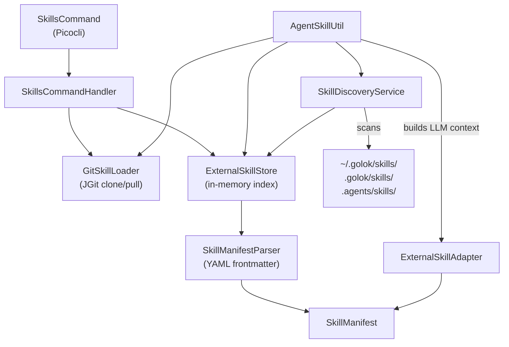
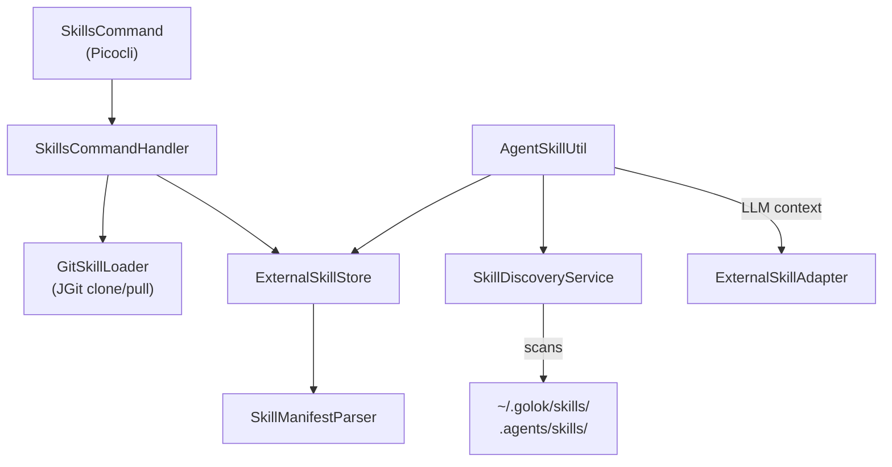

# golok Code Agent — Implementation Walkthrough

## Summary

Implemented the `golok-code-core` module with **11 Java source files** across 5 packages, enabling external skill management via the Agent Skills specification (SKILL.md format).

## Architecture




## golok Code Agent Architecture





## Usage

```bash
# Install skills from a git repo
golok skills add https://github.com/samber/cc-skills

# Install only specific skills
golok skills add https://github.com/samber/cc-skills --skill 'golang-*'

# List installed skills
golok skills list

# Show skill details
golok skills info conventional-git

# Update all installed repos
golok skills update

# Remove a skill repo
golok skills remove cc-skills
```