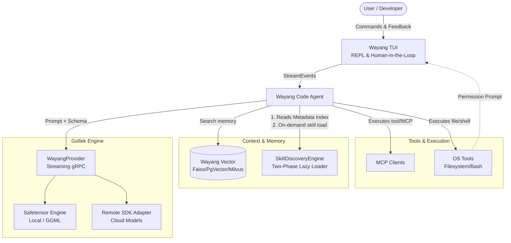

# Wayang Platform Architecture

Wayang is a comprehensive agentic coding platform designed for seamless local and remote AI integration. It focuses on modularity, context efficiency, and robust terminal-based interactions.

## Core Components

### 1. Agent Engine (Gollek SDK & Adapters)
At the heart of the platform is the **Gollek Engine**, which facilitates inference and interaction with LLMs.
- **Provider Abstraction**: Interacts with underlying models via `WayangProvider`, abstracting away the differences between various model architectures.
- **Local Engine (`safetensor-engine`)**: Wayang can run fully localized instances of models using its native safetensor loading and inference mechanisms, enabling privacy and offline capabilities.
- **Context Management**: Dynamically formats chat history and tool schemas to fit the context window constraints of the active model, natively mapping abstract `ToolDefinition` arrays into the specific chat templates (e.g., Llama, Qwen, Granite).

### 2. Terminal UI (TUI) & CLI
The primary developer interface is the **TUI (`wayang-tui`)** which runs a reactive Read-Eval-Print Loop (`ReplUi`).
- **Interactive Feedback**: The interface listens to streaming gRPC events from the agent (e.g., `StreamEvent.TextDelta`, `StreamEvent.ToolUseStart`) and translates them into real-time console updates.
- **Human-in-the-Loop**: When the agent attempts a potentially destructive tool call, the TUI safely blocks execution and prompts the user for permission (`[y]es/[a]lways/[n]o`).
- **Dynamic Indicators**: Visually reflects the state of inference (such as a spinning `⚙` gear when generating) to keep the user informed of background processing.

### 3. Skill Management (Two-Phase Lazy Loading)
Wayang implements an advanced, highly-optimized approach to injecting agent "skills" (modular guidelines and rules), inspired by the OPENDEV architecture:
- **Phase 1 (Metadata Indexing)**: On startup, the `SkillDiscoveryEngine` parses only the YAML frontmatter of local and global skills to extract their names and trigger descriptions. This tiny index is added to the system prompt (Zero-Copy), consuming negligible token space.
- **Phase 2 (On-Demand Agentic Loading)**: Using Chain of Thought, the LLM determines if a skill is needed based on the index. If so, it invokes an explicit tool to load the full Markdown instruction set into its context dynamically. A deduplication cache guarantees skills are only loaded once per session.

### 4. Vector Storage & RAG (Wayang Vector)
While *Skills* use lazy-loading, semantic codebase search and memory retrieval utilize true **RAG (Retrieval-Augmented Generation)**.
- **Multi-Backend Support**: The `wayang-vector` module supports interchangeable vector stores including FAISS, Milvus, Chroma, Qdrant, Pinecone, and PgVector.
- **Zero-Copy Optimization**: Embeddings are loaded and queried efficiently to retrieve chunks of code or documentation contextually relevant to the user's prompt, serving as the semantic "memory" of the agent.

### 5. Tools & MCP (Model Context Protocol)
Wayang integrates directly with OS-level tools and external MCP servers.
- **Tool Mapping**: Tools for viewing files, searching directories, and running shell commands are automatically mapped to JSON schemas.
- **Native Prompting**: To optimize for smaller context windows (e.g., 3B-8B models), Wayang passes raw tool schemas to the underlying execution engine, which natively formats them according to the specific model's pre-trained tool format, avoiding redundant or confusing manual prompt injections.

## System Flow Diagram

